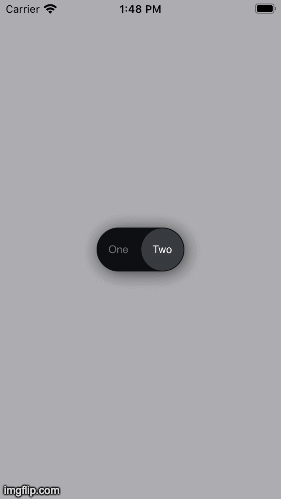

# CustomSwitcherDemo
Custom switcher. UIView that behaives same way as UISwitch.

### Usage:
* `code only (without StoryBoard)`
* `SnapKit`
* `Delegate`
* `Custom UIView`
* `UIStakeView`
* 'Animated'

 
### Features: 
* Switch between 2 values (you can use you text) with animation.
